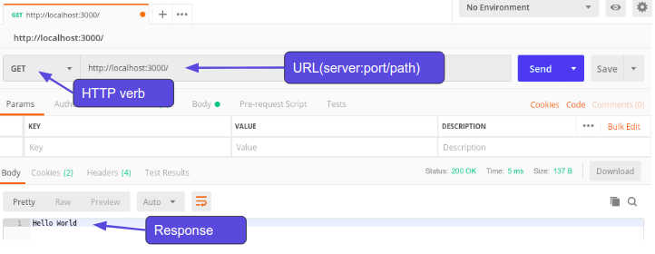
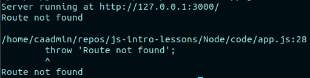
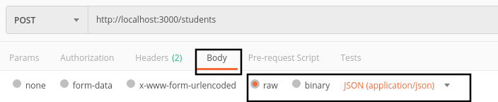
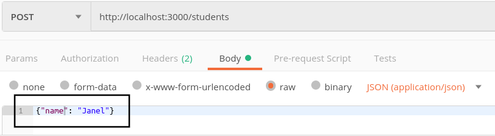

# Node.js

- [Node.js](#nodejs)
	- [Requirements](#requirements)
	- [References](#references)
	- [Node.js](#nodejs-1)
	- [Node.js Web Server](#nodejs-web-server)
	- [Using Postman](#using-postman)
	- [The request](#the-request)
	- [Basic routing](#basic-routing)
		- [Listing students - the /students route (GET)](#listing-students---the-students-route-get)
		- [Invalid route handling](#invalid-route-handling)
	- [NPM init, node_modules, and package.json](#npm-init-nodemodules-and-packagejson)
	- [Restarting after errors with Forever](#restarting-after-errors-with-forever)
		- [Forever](#forever)
		- [Maintaining a node project in GitHub](#maintaining-a-node-project-in-github)
	- [Automatic restart with nodemon](#automatic-restart-with-nodemon)
	- [Implementing the POST route handling](#implementing-the-post-route-handling)
		- [Sending data through Postman](#sending-data-through-postman)
		- [Adding the POST route handling](#adding-the-post-route-handling)
		- [Processing the POST data](#processing-the-post-data)
	- [Implement random student pairing for GET on '/'](#implement-random-student-pairing-for-get-on)
	- [Challenge](#challenge)

## Requirements

- Postman - https://www.getpostman.com/

## References

- [node.js](https://nodejs.org/en/docs/)
- [anatomy of an http transaction](https://nodejs.org/es/docs/guides/anatomy-of-an-http-transaction/)
- [Postman](https://www.getpostman.com/)

## Node.js

So what exactly is Node.js?

JavaScript has been used mainly for client-side scripting inside **< script >** tags executing in web browsers. This limitation meant that developers were often working in many different languages and frameworks between the front-end (client-side) and backend (server-side) aspects of a web application.  

Although there were other projects to bring JavaScript to server-side applications, the functionality took off with the launch of Node.js

Node allows developers to write JavaScript code that runs directly in a computer process itself instead of in a browser. Node can, therefore, be used to write server-side applications with access to the operating system, file system, and everything else required to build fully-functional applications.

In a nutshell Node.js allows JavaScript to be run on the machine and not just in a browser which opens up a world of possibilities.

## Node.js Web Server

We looked at this some weeks ago, but let's remember how we can create a simple http server in Node.js.

_Remind me - what is the purpose of a web server?_

The main purpose of any web server is to **store, process and deliver data** through the internet.

_What is the protocol that we use to send information across the web?_

Correct HTTP/S is the protocol we use.

_What are the HTTP verbs or methods that we can use when communicating over HTTP and what are those verbs meant to be used for?_

- **POST** - creating a resource
- **GET** - reading a resource
- **PUT** - updating a resource
- **PATCH** - updating a resource
- **DELETE** - removing a resource

_When we were programming our Rails application what was the name of the web server that came pre-configured with Rails?_

Correct it was Puma. Node.js also comes with a web server but unlike Rails we need to actually setup our web server using the HTTP module that come with Node.js. Lets first create a new file called app.js and require the http module.

app.js

```javascript
const http = require("http")
```

Now that we have the module required we can use it to create a web server in Node.

app.js

```javascript
const http = require("http")

const hostname = "127.0.0.1"
const port = 3000

// When we create an http server, we pass it a callback function that performs the actions of the server
const server = http.createServer((req, res) => {
	res.statusCode = 200 // status code
	res.setHeader("Content-Type", "text/plain") // header
	res.end("Hello World") // body
})
```

The callback function that performs the operations of the server is responsible for handling the request and sending a response. The response includes:

- a status code (the default is 200)
- a header
- a body

The example above shows how we can send those.

Creating the server isn't enough -we need to tell it to listen for requests:

```javascript
// What is the third argument to the listen method on http server? When do you think it is called?
server.listen(port, hostname, () => {
	console.log(`Server running at http://${hostname}:${port}/`)
})
```

To run the server we need to use Node.js

```
node app.js
```

Lets go to localhost:3000 and see if everything is working. Awesome! We have a web server running.

Now looking at our callback function in createServer() we have two arguments (req and res). _Req_ is short for _request_ and holds information about the HTTP request we sent to the server and _res_ is short for _response_ and used to generate and send the HTTP response from the server.

Some things to notice about our server:

- No routes (no matter what we type in to the url we are always getting the ‘Hello Word’ message)
- No HTTP verb, just like above it doesn’t matter what verb we are using, it is all going to the same place. We can test this with Postman.

## Using Postman

The simplest use of Postman is to send a request with no body to a URL. The URL will contain a server name, port, and optionally, a path:


You can change the request method to Post, Put, Delete - any of the choices - and we will see the response from the server. We'll use Postman in the lesson to test our POST request.

## The request

Lets take a look inside of the req argument to see if it has any information we can use to create different routes and display different information based on those routes.

app.js

```javascript
const http = require("http")

const hostname = "127.0.0.1"
const port = 3000

const server = http.createServer((req, res) => {
	console.log(req)
	res.end()
})

server.listen(port, hostname, () => {
	console.log(`Server running at http://${hostname}:${port}/`)
})
```

There is a bunch of information in the request object but the properties we are interested in to solve our issue is the **method** and **url** properties. We'll also look at the **headers** property.

app.js

```javascript
const http = require("http")

const hostname = "127.0.0.1"
const port = 3000

const server = http.createServer((req, res) => {
	// Using simple destructuring to pull out the properties we need from the request - this is handy syntax you'll see a lot
	const { method, url, headers } = req
	console.log(method)
	console.log(url)
	consoel.log(headers)
	res.end()
})

server.listen(port, hostname, () => {
	console.log(`Server running at http://${hostname}:${port}/`)
})
```

Looks like these hold the url for the request and the HTTP method used. Notice that the url is the full URL without the server, protocol or port. For a typical URL, this means everything after and including the third forward slash.

## Basic routing

Let's use the url and method information from the request object to create a new app that takes a list of students and matches two together randomly for eating lunch together. We will have 3 different routes:

- ‘/‘ - Match 2 students together and return the match
- ‘/students’ - Get a list of all of our students
- ‘/students’ - Create a new student

_Which HTTP verb should we use for each route?_

- ‘/‘ - Match 2 students together and return the match (GET)
- ‘/students’ - Get a list of all of our students (GET)
- ‘/students’ - Create a new student (POST)

Ok now we know the route and the HTTP verb lets modify our code to look for these.

Since we have a bit of code to write, we'll create a named callback function and pass that to createServer. Let's start with implementing GET on the root route ('/'). We'll just put a simple response for now:

app.js

```javascript
const http = require("http")

const hostname = "127.0.0.1"
const port = 3000

function serverResponse(req, res) {
	// This is where we'll define our callback function for the server
	const { method, url, headers } = req

	if (method === "GET" && url === '/') {
		res.setHeader("Content-Type", "text/plain")
		res.end("Matching students")
	}
}
const server = http.createServer(serverResponse)

server.listen(port, hostname, () => {
	console.log(`Server running at http://${hostname}:${port}/`)
})
```

If we go to localhost:3000 we can see that we are sending back a simple string, “Matching students”.

Now that we are only responding when we match GET on '/', we will see the client appear to hang if we try to visit any other url. We need to implement our other routes.

### Listing students - the /students route (GET)

First lets start with showing all of our students. To mock this data we will just create an array to hold the names.

```javascript
let students = [
	"Carlie",
	"Tony",
	"Sam",
	"Carl",
	"Sherine",
	"Lelani",
	"Aidan",
	"Jack",
	"Mark",
	"Rachel"
]
```

_What mime type we should set our Content-Type to?_

If we want to send back json then it should be application/json. If we want html then it should be text/html.
If we want plain text it should be text/plain (as we just saw).

For a list of mime types visit this link:

https://developer.mozilla.org/en-US/docs/Web/HTTP/Basics_of_HTTP/MIME_types/Complete_list_of_MIME_types

We could use text or json - our data is stored in an array. We'll use json, so if we decide to add more information to our students we could. Let's add this code to the if block for GET on /students:

app.js

```javascript
	if (method === "GET" && url === '/') {
		res.setHeader("Content-Type", "text/plain")
		res.end("Matching students")
	} else if (method === 'GET' && url === '/students') {
    console.log("Getting a list of students");
    res.setHeader('Content-type', 'application/json');
		res.end(JSON.stringify(students));
	}
```

After restarting the server and visiting localhost:3000/students we should see our student array. Lets now handle the functionality for when somewhen visits a route that doesn’t exist.

### Invalid route handling

When we get an invalid route, let's throw an error saying that the route does not exist.

We'll add a default case to our GET block that catches invalid routes:

app.js

```javascript
	if (method === "GET" && url === '/') {
		res.setHeader("Content-Type", "text/plain")
		res.end("Matching students")
	} else if (method === 'GET' && url === '/students') {
    console.log("Getting a list of students");
    res.setHeader('Content-type', 'application/json');
		res.end(JSON.stringify(students));
	} else {
		console.log('invalid route');
		throw('Route not found');
	}
```

Ok so everything is still fine if we go to /students buts lets take a look at if we go to route that doesn’t exist such as /class. We see an error in the console but…….oh no it looks like our node program has exited and the web server is now completely shut down.


If we try to go back to /students we can see that the web server is no longer running.

We need to use something that will restart our server if it errors and we don't catch it. This will be our first installed dependency for this app, so it's time to talk about our project environment.

## NPM init, node_modules, and package.json

Think of JavaScript packages like gems in Ruby. If you have Node.js installed on your computer then you also have `npm`. This is a package manager originally created for Node.js but is now used throughout the JavaScript community in all projects.

We use `npm init` to create a new confguration file name `package.json` that saves all of our project information.

```
npm init

//Continue to hit the enter key until it is done. This creates our file with all the defaults.
```

Now we have our `package.json` file we can install a JavaScript package via `npm`.

## Restarting after errors with Forever

Inevitably our web server will run into an error. We as programmers try our best to code for every possible situation but in the end we are human and some things just slip through the gaps. It would be very bad if our whole web server stopped working just because we hit one error we did not catch. So we need something that makes sure our web server will be rebooted if it ever encounters an error and exits.

### Forever

Forever is a CLI tool that ensures a given script is run continuously (IE forever). So if we want to ensure our web server will reboot after a crash we can let forever handle it. Lets install forever and get it setup. But instead of installing it globally, let's talk about `npm init`, package `node_modules`, and `package.json`.

```
npm install forever --save-dev
```

_Important - you should never sudo to install npm packages locally to a project._

This command does two things, first it saves our third party packages into a directory called `node_modules`. Second it automatically modifies our `package.json` file to keep track of our project dependencies. In this case we have specified that `forever` is a development dependency only, and we don't want it to be part of our production environment.

You might see a lot of documentation that says you need to include the `--save` or `-s` flag to `npm install` to save dependencies, but this is done by default as of `npm 5.0`.

One of the great things about `npm` is that we only need to keep track of our `package.json` file in our repo. We can install all of a projects dependencies simply by running **npm install**.

_Delete the node_modules directory and then run npm install. Notice how it recreated the directory and installed all of the dependencies from our package.json file (in this case it was only forever)._

---

### Maintaining a node project in GitHub

Since we can recreate `node_modules` just by running `npm i`, as long as our `package.json` is up to date, we don't have to commit or push it to our repo, and we shouldn't - it gets huge!

Remember to always include a `.gitignore` in your project directory that excludes `node_modules/`.

---

Now lets run `forever`.

```
./node_modules/.bin/forever -c "node" app.js
```

Now if we encounter an error `forever` will restart our web server.

## Automatic restart with nodemon

Another package we can take advantage of is `nodemon`. Nodemon is tool that watches for changes to any of our Node files and restarts the server when a change is made. This will save us from having to start and stop the server manually all the time. Lets install it.

```
npm i nodemon --save-dev
```

_npm i is shorthand for npm install_

Now normally we would run `nodemon` by calling the `nodemon` command and the name of our script but we want `forever` to run too. So instead we can get both of these running by doing this.

```
./node_modules/.bin/forever -c "nodemon —exitcrash -L" app.js
```

And there we go now we have the best of both worlds. But looking at this kinda gives me a headache so lets turn this into a much simpler command by adding it as an `npm script`.

We can add as many scripts as we want to our `package.json` to create aliases for commands. We just give the script a name (the alias), and specify the command, like we do here for `node-server` to start our server app using `nodemon` and `forever`:

package.json

```javascript
{
    "name": "app",
    "version": "1.0.0",
    "description": "",
    "main": "app.js",
    "scripts": {
        "test": "echo \"Error: no test specified\" && exit 1",
        "node-server": "forever -c \"nodemon --exitcrash -L\" app.js"
    },
    "author": "",
    "license": "ISC",
    "devDependencies": {
        "nodemon": "^1.18.6”,
        "forever": "^0.15.3"
    }
}
```

Now all we have to do to get our web server running is to type this command.

```
npm run node-server
```

## Implementing the POST route handling
Now we'll implement the POST route. The easiest way to test POST route handling in a web server is using Postman.

### Sending data through Postman
We can send JSON data through Postman to our APIs. To do this, we specify a body to our request, with a type of JSON:


In the text area provided in Postman, we can specify some strigified JSON. We will use a property 'name' to identify the student name we are sending:


If we search through the output in the terminal window there is no property holding the name we sent through to add a student. That is because at the moment the body information of the request is in the form of a stream. We'll have to handle this stream data if we're using the http module. We'll see an easier way to do this in the next lesson with express.js.

### Adding the POST route handling

Let's add another if block to handle a POST method on '/students':

```javascript
	if (method === "GET" && url === '/') {
		// Get request on '/'
		res.setHeader("Content-Type", "text/plain")
		res.end("Matching students")
	} else if (method === 'GET' && url === '/students') {
		// Get request on '/students'
    console.log("Getting a list of students");
    res.setHeader('Content-type', 'application/json');
		res.end(JSON.stringify(students));
	} else if (method === "POST" && url === "/students") {
		// Post request on '/students'
		console.log("received a POST request")
		res.setHeader("Content-Type", "application/json")
		// Handle data in data and end events on req
	} else {
		// Invalid method or url
		console.log('invalid route');
		throw('Route not found');
	}
```

### Processing the POST data
When we POST a new student to our server, we need to process the data sent in the request. The request object passed in the connection callback is a **stream**.

In order to process the request body content with Node.js, we must listen to a **data** event on the request when a data stream is received, and also for an **end** event when the request is complete. The data stream is received in chunks, so we have to process those chunks.

We first get the data by listening to the stream data events, and when the data ends, the stream end event is called. This also goes inside of our callback function `serverResponse`. We can put it below our route handling code:

```javascript
// Handle getting data from the client request (on POST)
let data = [] // Used to collect chunks of data
req.on("data", chunk => {
	// Make sure data was sent on the right url
	if(url === '/students') {
		// This event fires when we receive data in the request. The data comes in chunks
		console.log(`Data chunk available: ${chunk}`)
		// We need to parse the chunk, or we will store it as a stream object
		data.push(JSON.parse(chunk))
	}
})
req.on("end", () => {
	// The end event signifies the end of the request, and therfore the end of the data stream
	// We'll store any data we got from a post in our array, then send our response to the client
	// If we got data (for a post), add it to our array of students
	// In this case, we only expect to get a single chunk of data - just a student name to add to our array of students
	if (data.length > 0) {
		console.log("retrieved data", data[0])
		students.push(data[0].name)
		// Send the stringified list of students we've constructed according to the route and method
		res.statusCode = 201
		res.end(JSON.stringify(students))
	}

})
```

Let's make sure everything is working. Try:

- In a browser, go to /class. Verify you get an invalid route message and the server keeps running.
- In a browser, go to /students. Verify you see the array of students.
- In Postman, add a student. Verify it returns the updated list of students.
- In a browser, go to /students. Verify you see the updated list of students.

## Implement random student pairing for GET on '/'

The only thing left to do is to implement a function that will randomly select two students from the array of students, and return those 2 students in the response to a GET request on '/'.

Try to do this yourself before you look at the completed code in the `app_complete.js` file.

## Challenge

Implement persistence in a file on the server. Use a text file to store the list of students.

1. Read from the file in your server to populate the array of students.
2. Every time a student is added, update the .txt file along with the array in memory to store the new student.
3. Verify that now, even if you stop and restart the server, your student list is updated.

*Hint* You can use fs.readFileSync to read in the contents of the file, split on '\n', and store in an array. You can use fs.writeFileSync with join on '\n' to write back the updated array.
